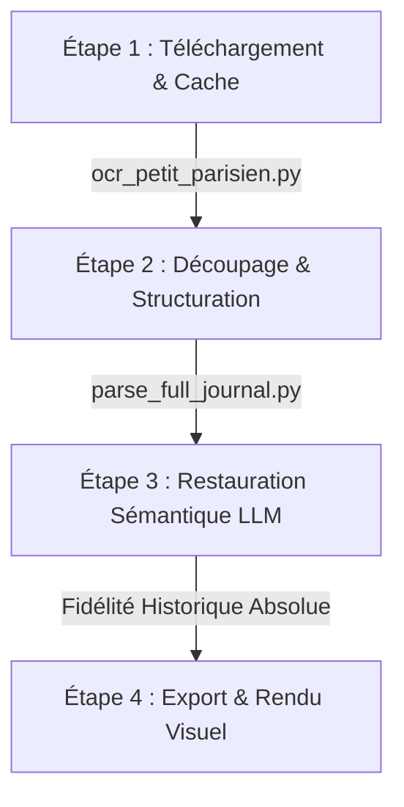

# Processus Journalier d'Archivage & Restauration

Ce guide décrit la méthodologie complète étape par étape pour récupérer, segmenter, restaurer et intégrer les numéros historiques de *Le Petit Parisien* fin 1899.

---

## 📋 Résumé du Workflow Journalier



---

## 🛠️ Description Détaillée des Étapes

### Étape 1 : Téléchargement et OCR initial (Python + Cache)
Le script Python principal gère le téléchargement des pages depuis Gallica et le stockage en cache local pour éviter les requêtes réseau superflues.
- **Commande à exécuter :**
  ```bash
  python ocr_petit_parisien.py --date AAAA-MM-JJ --method api
  ```
- **Fonctionnement :**
  - Le script résout l'ARK Gallica pour la date demandée.
  - Il télécharge l'OCR brut BnF pour les 4 pages de l'édition via l'API AJAX `texteImage` (très rapide et précis).
  - Il effectue un pré-nettoyage automatique (retrait des balises HTML, reconnexion des césures de fin de ligne).
  - Si les fichiers existent déjà dans le dossier de cache `output/raw/le_petit_parisien/{ARK}/`, le script réutilise les fichiers existants sans solliciter le réseau.

---

### Étape 2 : Découpage et Segmentation (Python)
Pour isoler les articles de chaque page et les structurer :
- **Commande à exécuter :**
  ```bash
  python parse_full_journal.py
  ```
- **Fonctionnement :**
  - Le script lit le fichier OCR complet propre de la journée.
  - Il sépare le texte page par page.
  - Il découpe chaque page en articles distincts en se basant sur une liste d'expressions régulières ciblant les rubriques et titres d'époque.
  - Il génère un premier **résumé automatique** (les premières phrases, d'environ 200 à 250 caractères).
  - Il exporte le tout sous forme d'une structure de données propre dans `output/journal_data.js`.

---

### Étape 3 : Restauration Sémantique (LLM / Prompt)
Les colonnes étroites des journaux de 1899 provoquent inévitablement du **bruit algorithmique** (mélange de phrases d'articles différents à cause d'une lecture horizontale, mots estropiés). 
**C'est à cette étape qu'intervient l'intelligence artificielle (LLM) comme restaurateur numérique de textes.**

- **Méthode :**
  Prendre le texte segmenté de chaque article et le soumettre à l'IA avec le prompt de restauration suivant :
  
  > **Prompt de Restauration Sémantique :**
  > *"Tu es un archiviste et restaurateur numérique de textes anciens français du XIXe siècle.
  > Ta tâche est de nettoyer et restaurer ce texte brut issu d'une numérisation OCR défectueuse :
  > 1. Corrige les fautes de frappe et mots estropiés de l'OCR (ex: 'dfteg-nci&s' -> 'déguenillés').
  > 2. Détecte et démêle les mélanges de colonnes (lorsque des fragments de phrases d'autres articles se sont glissés horizontalement au milieu du texte). Supprime ces morceaux parasites.
  > 3. Reconstitue des phrases et paragraphes fluides, naturels et extrêmement agréables à lire.
  > 4. Conserve scrupuleusement le style littéraire d'époque, la ponctuation historique et 100% de la substance des faits rapportés sans inventer de nouvelles informations."*

---

### Étape 4 : Charte Éthique & Politique d'Archivage (Gestion des termes sensibles)

> [!IMPORTANT]
> **Règle d'Or : Fidélité Absolue au Texte d'Origine**
>
> Lors de la phase de restauration sémantique (Étape 3), il est possible de rencontrer des termes historiquement chargés, obsolètes ou profondément offensants aujourd'hui (comme le mot **"nègre"**, des expressions coloniales ou des termes raciaux d'époque).
> 
> **La consigne stricte est de ne JAMAIS censurer, atténuer, moderniser ou remplacer ces mots.**
>
> **Pourquoi ?**
> - **Intégrité Scientifique :** Altérer la source primaire détruirait la valeur archivistique et scientifique du projet.
> - **Témoignage Historique :** Conserver le vocabulaire exact de 1899 est indispensable pour permettre aux chercheurs et lecteurs d'analyser l'idéologie, la propagande médiatique et les mentalités de la fin du XIXe siècle (période coloniale, Dreyfus, etc.).
> - **Ligne de conduite :** Le mot d'époque doit être transcrit exactement tel qu'il a été imprimé en 1899. En revanche, l'IA ou l'archiviste moderne s'abstient rigoureusement d'employer ce vocabulaire dans ses propres analyses ou commentaires contemporains.

---

### Étape 5 : Rendu Visuel et Présentation Premium
Une fois les articles restaurés et enregistrés dans `journal_data.js` :
- Ouvrir le fichier interactif 📄 [journal_26_novembre.html](file:///c:/Users/amara/-=-%20Apps%20-=-/1899/output/journal_26_novembre.html) dans un navigateur.
- Vérifier le rendu visuel (esthétique crème rétro-moderne), la clarté des résumés et la fluidité de l'accordéon pour afficher le texte intégral restauré.
